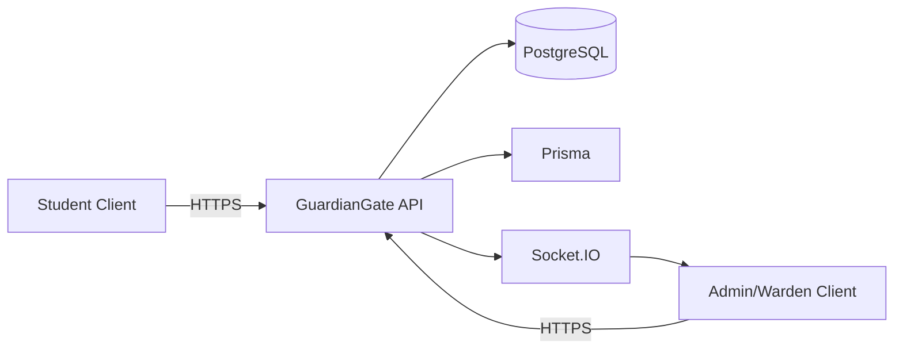

# GuardianGate Unified Project Documentation

This document is the technical reference for the currently implemented GuardianGate system. It reflects the latest state of frontend, backend, data model, role controls, QR behavior, attendance operations, and payment governance.

## 1. Product Overview

GuardianGate is a role-based hostel platform for operations and gate control.

Active roles:

- ADMIN
- WARDEN
- STUDENT

Primary capability areas:

- Authentication and session management
- QR gate token generation and student scan validation
- Entry/exit logs and dashboard analytics
- Hostel attendance operations
- Request workflows (leave, guest, parcel, medical, maintenance, housekeeping, suggestions, missing reports)
- Campus modules (events, notices, emergency, mess)
- Admin payment management

## 2. Monorepo Layout

- frontend: React + Vite + TypeScript application
- services/api: Express + TypeScript + Prisma API service
- packages/shared: shared Zod contracts and types
- supabase/migrations: SQL migration scripts
- docs: architecture/setup/API docs

## 3. Technology Stack

- Frontend: React, Vite, TypeScript, React Router, TanStack Query
- Backend: Node.js, Express, TypeScript
- Database: PostgreSQL via Prisma
- Realtime: Socket.IO
- Security: JWT access token + refresh cookie, RBAC middleware, rate limiting, request IDs

## 4. Architecture Snapshot

## 5. Authentication and Session Flow

1. User signs in from role-specific login page.
2. Backend validates credentials, account status, role, and client policy.
3. Access token is used for protected API calls.
4. Refresh token cookie is used by /auth/refresh for silent renewal.
5. First-login users are redirected to /auth/change-password.

## 6. Role and Permission Model

### ADMIN

- Full access to admin dashboard modules
- User management
- Attendance management
- QR generation and logs
- Emergency create/resolve
- Payment management (exclusive)

### WARDEN

- Attendance management
- QR generation and logs
- Workflow processing and campus modules
- No payment management access

### STUDENT

- Student dashboard and personal modules
- Camera-based QR scan for own entry/exit
- Own attendance and own request/history data
- No admin-only modules (including payments)

## 7. Payment System (Current)

Payment handling is ADMIN-only.

Backend enforcement:

- GET /api/v1/campus/payments/admin
- POST /api/v1/campus/payments/admin/:id/update
- Both endpoints require ADMIN role.

Frontend enforcement:

- /admin/payments is restricted by route-level role policy.
- WARDEN and STUDENT cannot access payment management page.

Implemented admin actions:

- search/filter fee records
- update paid amount
- maintain payment mode and remarks
- enforce status consistency (PAID, PARTIAL, PENDING, OVERDUE)
- persist audit metadata

## 8. Attendance System (Current)

Attendance is managed digitally with floor-level operations.

Structure:

- hostel -> floor -> room -> student

Implemented flow:

1. Warden/admin loads floor options.
2. Chooses hostel, floor, date, NIGHT session.
3. Marks student attendance statuses in-room or full-floor mode.
4. Saves via floor save endpoint; records are finalized with verifier metadata.

Student visibility:

- attendance summary counters
- attendance percentage
- recent attendance rows

## 9. QR Entry/Exit System (Current)

### Admin/Warden QR Center

- QR generation tab and logs tab inside QR Center
- gate token lifecycle with 30-second refresh behavior
- logs tab auto-refreshes and supports filters/summaries

### Student QR Scanner

- camera-first scanner implementation
- auto camera start with permission handling
- permission-denied and unsupported-device fallback behavior
- manual token input available as fallback path

## 10. Entry/Exit Logic (Current)

Action derivation:

- student current status determines next action (ENTRY <-> EXIT)

EXIT behavior:

- destination required
- if missing, API returns REQUIRES_EXIT_DETAILS and client asks for destination/note
- successful exit stores destination and optional note in log remarks

ENTRY behavior:

- entry timestamp stored
- late and flagged values are computed only for ENTRY using configured cutoff time

## 11. Entry/Exit Logs and Monitoring

Admins and wardens can view logs and analytics in QR Center and dashboard.

Available log visibility:

- all logs
- late entries
- flagged records
- student/hostel/floor/room/date/direction filters

Log content includes:

- student details
- direction and scan time
- destination (for EXIT)
- late status and flagged status

## 12. Scanner Reliability Improvements

Recent hardening implemented:

- camera-based decode pipeline
- permission-aware retry flow
- duplicate scan submit prevention with client-side lock
- replay protection in backend
- stable scan-to-log behavior with frequent manager-log refresh

## 13. Backend API Domains

Route prefixes under /api/v1:

- /auth: login, refresh, logout, profile, password change, admin signup
- /qr: gate token generation
- /scan: student scan submit
- /dashboard: overview, attendance, logs, notifications, reports
- /workflows: leave/guest/parcel/medical/suggestion/mess/missing reports
- /campus: events/notices/emergency/payments/maintenance/housekeeping/room/contacts/history
- /admin: user management operations

## 14. Database Model Overview

Key models:

- User, Student, WardenProfile
- HostelBlock, Floor, Room, RoomAllocation
- QrToken, EntryExitLog, AttendanceRecord
- FeeRecord, Payment
- NightLeaveRequest, GuestRequest, MedicalRequest, ParcelRecord
- MaintenanceRequest, HousekeepingRequest, Suggestion, MissingReport
- Notice, Event, EmergencyNotification, Notification
- AuditLog, EmailLog

## 15. Frontend Composition

- App routes are divided into:
  - public/auth routes
  - /student routes under StudentLayout
  - /admin routes under DashboardLayout
- QR Center is reused for:
  - manager QR generation/logs
  - student camera scanning
- Session client adds Authorization and X-Request-Id to authenticated calls and performs single refresh retry on 401.

## 16. Local Runbook

From repository root:

- npm install
- npm run dev:all

Useful checks:

- npm run build
- npm run test
- npm run lint

Defaults:

- Frontend: http://localhost:8080
- API: http://localhost:3000
- Health: http://localhost:3000/health

## 17. Constraints and Notes

- Single-admin governance remains enforced.
- Active product roles are ADMIN, WARDEN, STUDENT.
- Payment management is admin-exclusive by route and role guard.
- Entry late/flag logic applies only to ENTRY, not EXIT.

## 18. Key References

- frontend/src/App.tsx
- frontend/src/lib/routing.ts
- frontend/src/features/dashboard/qr-center/QRCenterPage.tsx
- frontend/src/features/dashboard/attendance/AttendancePage.tsx
- frontend/src/features/student/StudentAttendancePage.tsx
- frontend/src/features/dashboard/payments/AdminPaymentsPage.tsx
- services/api/src/routes/campus.routes.ts
- services/api/src/controllers/campus.controller.ts
- services/api/src/controllers/scan.controller.ts
- services/api/prisma/schema.prisma
- docs/api-reference.md

---

Document status: synchronized with current implementation as of 2026-04-03.
